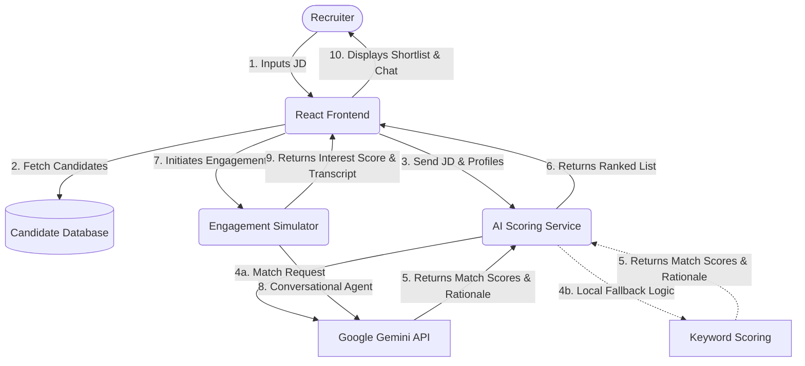

# AI-Powered Talent Scouting & Engagement Agent

An intelligent web-based prototype designed to help recruiters streamline the talent acquisition process. This agent takes a Job Description (JD) as input, discovers matching candidates from a database, and simulates conversational outreach to assess genuine interest.

## Features

- **JD Parsing & Matching**: Evaluates candidate profiles against the provided Job Description.
- **Explainability**: Provides a one-sentence rationale for the Match Score.
- **Simulated Conversational AI**: Simulates an automated chat between an AI Agent and the candidate to gauge salary expectations and interest.
- **Ranked Output**: Outputs a clear, actionable shortlist ranked by Match Score and augmented by an Interest Score.

## Setup Instructions

### Prerequisites
- [Node.js](https://nodejs.org/) (v18 or higher recommended)
- `npm`

### Running Locally

1. **Navigate to the app directory:**
   ```bash
   cd scout-app
   ```

2. **Install dependencies:**
   ```bash
   npm install
   ```

3. **Start the development server:**
   ```bash
   npm run dev
   ```

4. **Access the Application:**
   Open your browser and navigate to `http://localhost:5173`.

## Architecture Diagram

The system is built on a React (Vite) frontend with a simulated AI service layer that optionally calls Google's Gemini API (or falls back to a robust local ranking logic for demo purposes).



## Scoring & Logic Description

This prototype evaluates candidates on two primary dimensions:

### 1. Match Score (0 - 100%)
The Match Score determines how well a candidate's technical skills and experience align with the Job Description.
- **AI Logic**: The system prompts a Large Language Model (Gemini 1.5 Flash) with the JD and candidate profiles to generate an objective 0-100 score and a 1-sentence explainability.
- **Fallback Logic**: In the event of API quota limits, a robust local scoring system adds points based on keyword overlaps between the candidate's skills/role and the text in the JD.

### 2. Interest Score (0 - 100%)
The Interest Score simulates the candidate's genuine interest in the role after an initial AI outreach.
- **Simulation**: The system simulates a 4-message exchange. The AI agent asks a qualifying question (e.g., regarding salary or location expectations based on the JD).
- **Evaluation**: Based on the candidate's authentic response to these parameters, the system assigns an Interest Score (e.g., 90% if salary matches, lower if they are hesitant).

## File Structure
- `scout-app/src/App.tsx`: Main UI containing the dashboard and drawer.
- `scout-app/src/services/aiService.ts`: Core AI integration logic and local fallbacks.
- `scout-app/src/data/mockCandidates.ts`: The static database of candidate profiles.
- `sample_io.md`: Example inputs and outputs used for validation.
